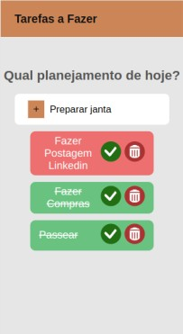
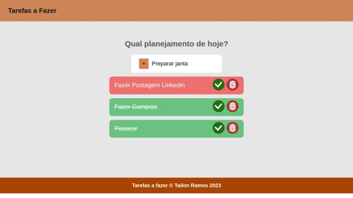

# Tarefas a fazer

# Índice
- [Proposta](#id01)
- [Desafios](#id02)
- [Screenshots](#id03)
- [Links](#id04)
- [Feito_com](#id05)
- [Autor](#id06)

# 🚀 Proposta 

Um aplicativo de gerenciamento de tarefas estilo ToDo List. As tecnologias usadas foram React.JS.
A ideia é organizar as ideias em _"bloquinhos"_ e, à medida que os serviços forem sendo concluídos o usuário pode marcar como concluído ou apagar o lembrete, além da função de editar. 

 

Data do início: 24/01/2023

# Desafios 

As maiores dificuldades foram: conectar as funções e seus retornos por props; e consultar o id do objeto para sua edição. Para solucionar o problema procurei ajuda no canal do youtube Brian Design.

O maior aprendizado foi trabalhar com responsividade no React.JS, através de um css escopado pude trabalhar com media queries.

Um grande desafio foi poder expor o trabalho e deixa-lo público, através de um serviço de provedor. usei o Netlify para fazer o deploy na aplicação em React.

# :camera_flash: Screenshots 

 

## :iphone: Mobile design

  </img>

## :desktop_computer: Desktop design

  </img>

# :heavy_check_mark: Links 

- Link para acessar: https://front-tarefasafazer.netlify.app/

 

- Link para o video auxiliar do Brian Design: https://www.youtube.com/watch?v=E1E08i2UJGI

# 🛠 Feito com 

 

- 
- 
- 
- 

# :sunglasses: Autor 

- GitHub: https://www.github.com/RamosTailon

- Email: [tailonramos11@gmail.com](mailto:tailonramos11@gmail.com)

- Linkedin: https://www.linkedin.com/in/tailon-ramos-25271022a/